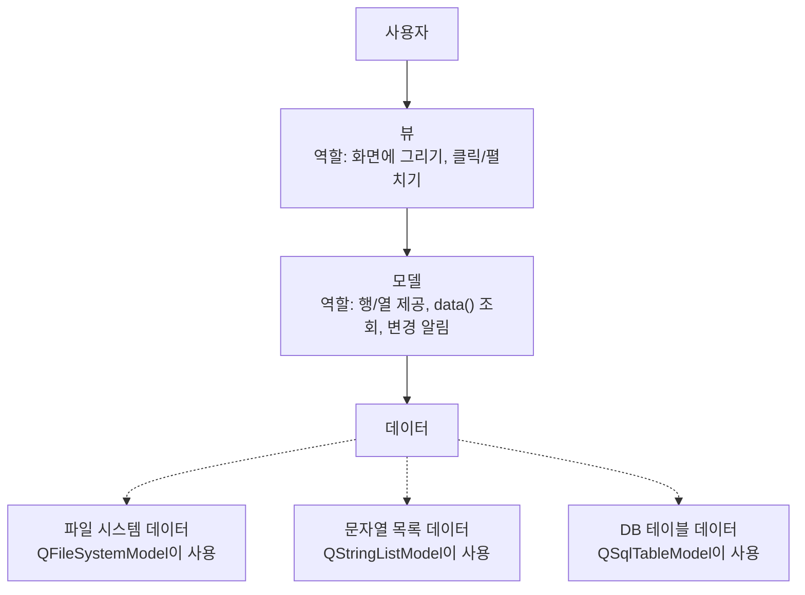
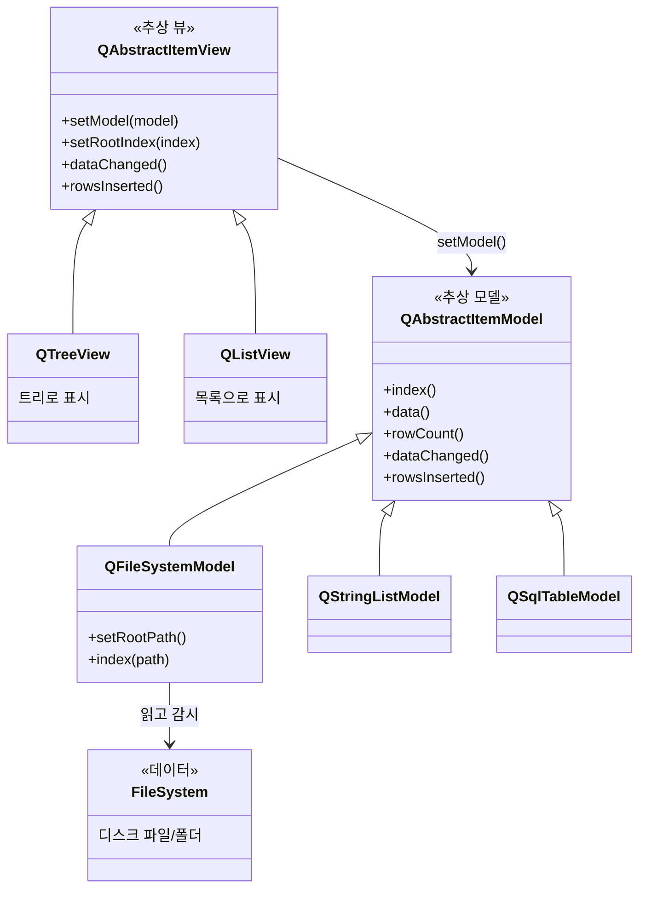
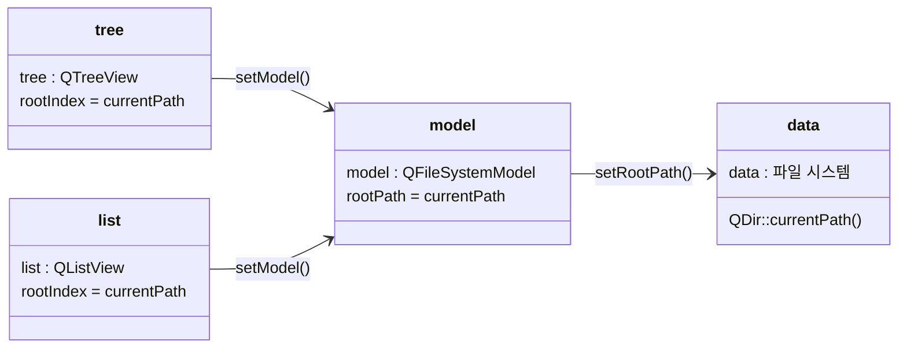
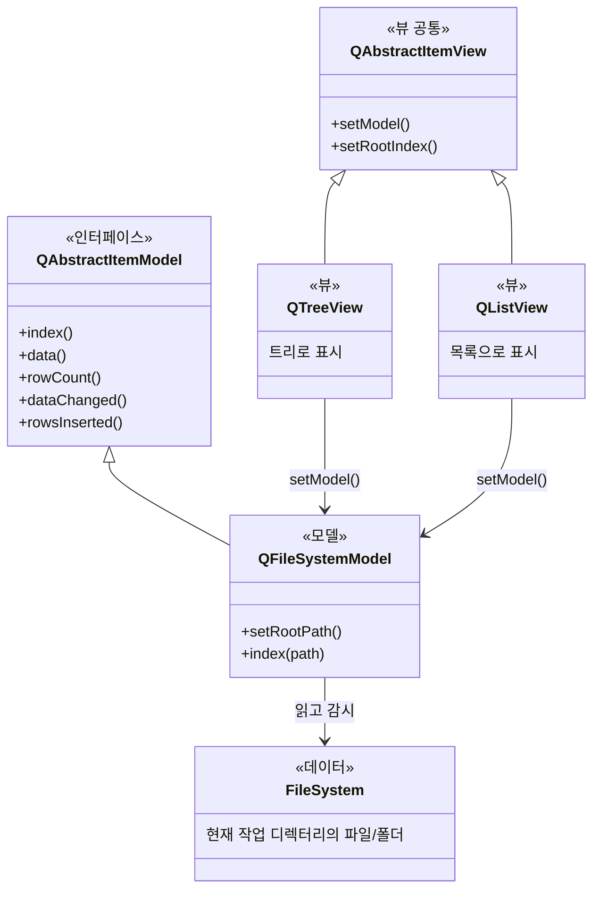
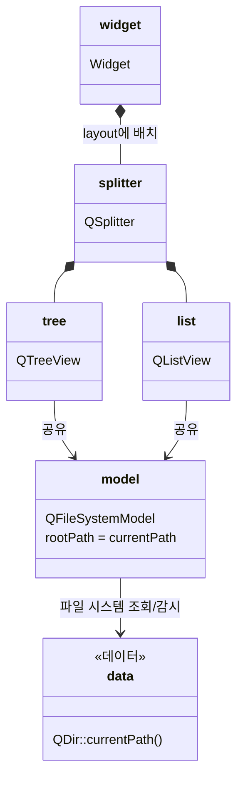
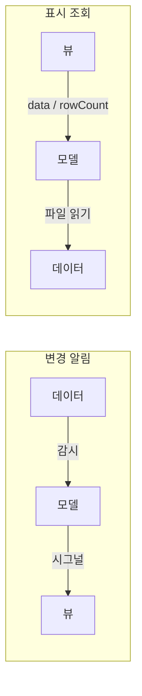
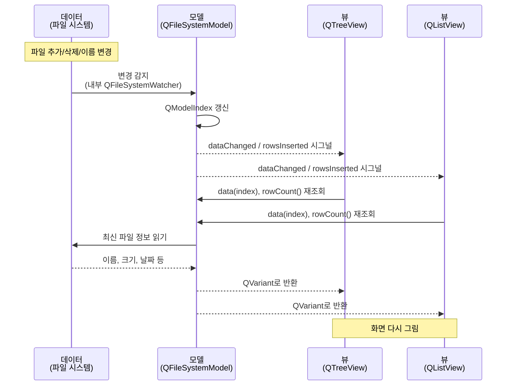
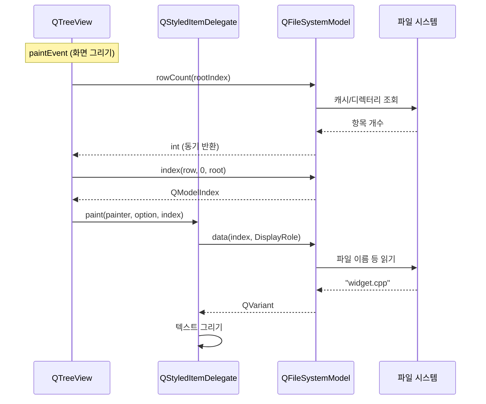
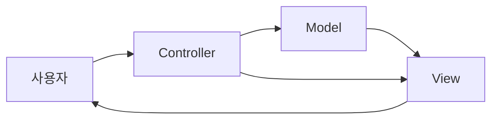

# Qt 모델 뷰 개념

Section 9 `P01_ModelView` 예제를 기준으로, Qt Model/View를 데이터·모델·뷰로 나누고, 변경 알림과 화면 조회, 자바 MVC와의 차이를 정리한 문서입니다.

실습 코드는 `section09/P01_ModelView` 입니다. 현재 작업 디렉터리의 파일/폴더를 **모델 하나**로 읽고, `QTreeView`와 `QListView` **두 뷰**가 같은 모델을 보여 줍니다.

```cpp
QFileSystemModel *model = new QFileSystemModel;
model->setRootPath(QDir::currentPath());

tree->setModel(model);
list->setModel(model);
```

---

## 목차

1. [이 문서에서 다루는 것](#1-이-문서에서-다루는-것)
2. [실습 코드](#2-실습-코드)
3. [데이터 / 모델 / 뷰](#3-데이터--모델--뷰)
4. [도메인 설계: 협력 관계, 클래스 다이어그램, 객체 다이어그램](#4-도메인-설계-협력-관계-클래스-다이어그램-객체-다이어그램)
5. [전체 구조](#5-전체-구조)
6. [클래스 관계 UML](#6-클래스-관계-uml)
7. [런타임 객체 관계](#7-런타임-객체-관계)
8. [두 가지 흐름: 알림과 조회](#8-두-가지-흐름-알림과-조회)
9. [데이터 변경 시 — 시그널/슬롯](#9-데이터-변경-시--시그널슬롯)
10. [화면 조회 시 — 직접 호출](#10-화면-조회-시--직접-호출)
11. [자바 MVC와 비교](#11-자바-mvc와-비교)
12. [한눈에 보는 정리](#12-한눈에-보는-정리)

---

## 1. 이 문서에서 다루는 것

Qt Model/View는 리스트·트리·테이블처럼 **항목을 보여 주는 위젯**을 위한 패턴입니다. 앱 전체의 화면 흐름을 나누는 자바 MVC와 이름이 비슷하지만, 적용 범위와 역할이 다릅니다.

이 문서는 아래 순서로 정리합니다.

| 단계 | 내용 |
| --- | --- |
| 구분 | 데이터, 모델, 뷰가 각각 무엇인지 |
| 도메인 설계 | 협력 관계, 클래스 다이어그램, 객체 다이어그램 |
| 구조 | 클래스 관계, 런타임 객체, 레이아웃과의 차이 |
| 알림 | 데이터가 바뀔 때 `데이터 → 모델 → 뷰` (시그널/슬롯) |
| 조회 | 화면을 그릴 때 `뷰 → 모델 → 데이터` (직접 호출) |
| 비교 | 자바 MVC, Swing `TableModel`과의 대응 |

Qt 버전은 6.5 이상을 기준으로 합니다.

---

## 2. 실습 코드

`section09/P01_ModelView/widget.cpp` 생성자입니다.

```cpp
setWindowTitle("Model/View - QTreeView and QListView");

resize(600, 300);
QSplitter *splitter = new QSplitter(this);

// Model class
QFileSystemModel *model = new QFileSystemModel;
model->setRootPath(QDir::currentPath());

// View widget - QTreeView
QTreeView *tree = new QTreeView(splitter);
tree->setModel(model);
tree->setRootIndex(model->index(QDir::currentPath()));

// View widget - QListView
QListView *list = new QListView(splitter);
list->setModel(model);
list->setRootIndex(model->index(QDir::currentPath()));

QVBoxLayout *layout = new QVBoxLayout();
layout->addWidget(splitter);
setLayout(layout);
```

이 코드에 `connect()`는 없습니다. 모델과 뷰의 시그널/슬롯 연결은 `setModel()` 안에서 Qt가 수행합니다.

`QSplitter`와 `QVBoxLayout`은 화면 배치용입니다. Model/View 역할에는 들어가지 않습니다.

---

## 3. 데이터 / 모델 / 뷰

역할을 섞지 않으면 아래와 같습니다.

| 역할 | 이 예제에서 | 하는 일 |
| --- | --- | --- |
| **데이터** | 파일 시스템 | 실제 정보. 화면에 직접 그리지 않음 |
| **모델** | `QFileSystemModel` | 데이터를 읽고, `QModelIndex`로 접근하게 함 |
| **뷰** | `QTreeView`, `QListView` | 모델을 화면에 그림. 데이터는 직접 안 가짐 |

한 줄로 쓰면 다음과 같습니다.

```
데이터  = 디스크의 파일/폴더 (QDir::currentPath())
모델    = QFileSystemModel   (데이터를 QModelIndex로 제공)
뷰      = QTreeView + QListView  (같은 모델을 다른 UI로 표시)
```

### 3.1 데이터

데이터는 현재 작업 디렉터리의 파일과 폴더입니다.

```cpp
model->setRootPath(QDir::currentPath());
```

- `QDir::currentPath()` → 프로그램이 실행된 폴더
- 그 안의 디렉터리, 파일 이름, 크기, 수정 시각 등이 데이터

이 데이터는 코드 안의 `QStringList`나 배열이 아닙니다. **디스크에 있는 파일 시스템**입니다. 위젯이 파일을 복사해 두지 않고, 모델이 필요할 때 조회합니다.

### 3.2 모델

쓰는 클래스는 `QFileSystemModel`입니다.

```cpp
QFileSystemModel *model = new QFileSystemModel;
model->setRootPath(QDir::currentPath());
```

모델은 화면을 그리지 않습니다. 파일 시스템을 Qt가 정한 표 형태(행/열/부모-자식)로 노출하는 **데이터 접근 계층**입니다.

대략 이런 트리입니다.

```
현재 폴더 (root)
 ├── 하위폴더A
 │    ├── 파일1
 │    └── 파일2
 ├── 하위폴더B
 └── 파일3.cpp
```

`QFileSystemModel`은 `QAbstractItemModel`을 구현해서, `QTreeView`/`QListView`가 같은 API로 이 트리를 읽게 합니다.

`setRootIndex(model->index(...))`의 `index()`는 “이 경로에 해당하는 모델 위치”를 돌려줍니다. 뷰의 시작점이 그 인덱스가 됩니다.

### 3.3 뷰

뷰는 두 개이고, **같은 모델**을 봅니다.

```cpp
QTreeView *tree = new QTreeView(splitter);
tree->setModel(model);
tree->setRootIndex(model->index(QDir::currentPath()));

QListView *list = new QListView(splitter);
list->setModel(model);
list->setRootIndex(model->index(QDir::currentPath()));
```

| 뷰 | 클래스 | 표시 방식 |
| --- | --- | --- |
| 트리 | `QTreeView` | 폴더를 접고 펼치는 계층 |
| 리스트 | `QListView` | 한 레벨을 목록으로 |

둘 다:

1. `setModel(model)` → 같은 `QFileSystemModel`에 연결
2. `setRootIndex(...)` → 현재 디렉터리를 루트로 표시

뷰는 파일 목록을 멤버로 들고 있지 않습니다. 그릴 때마다 모델에 물어봅니다.

이 예제가 보여 주려는 점은 **모델은 하나, 뷰는 여러 개**입니다. 데이터가 바뀌면 모델만 갱신하면 트리와 리스트가 함께 따라갑니다.

---

## 4. 도메인 설계: 협력 관계, 클래스 다이어그램, 객체 다이어그램

자바 회원 도메인을 그릴 때처럼, 데이터·모델·뷰도 **협력 관계 → 클래스 다이어그램 → 객체 다이어그램** 세 장으로 나눕니다.

회원 예제에서 저장소 구현을 갈아 끼우듯, Qt에서는 **모델 구현을 갈아 끼웁니다.** 뷰는 `QAbstractItemModel`만 알고, 뒤에 파일 시스템이 있는지 문자열 목록이 있는지는 모릅니다.

### 4.1 협력 관계 (역할과 책임)

회원 도메인의 “클라이언트 → 회원 서비스 → 회원 저장소”에 대응합니다.



| 역할 | 이 예제 | 책임 (무엇을 하는가) |
| --- | --- | --- |
| **뷰** | `QTreeView`, `QListView` | 그리기, 선택, 펼치기. 데이터는 직접 안 가짐 |
| **모델** | `QFileSystemModel` | `rowCount()`, `index()`, `data()` 제공. 변경 시 시그널 |
| **데이터** | 현재 폴더의 파일/폴더 | 실제 정보. 화면을 모름 |

협력에서 오가는 메시지는 두 종류입니다.

| 언제 | 메시지 | 방향 |
| --- | --- | --- |
| 화면을 그릴 때 | `rowCount()`, `data()` **직접 호출** | 뷰 → 모델 → 데이터 |
| 파일이 바뀔 때 | `dataChanged` 등 **시그널** | 데이터 → 모델 → 뷰 |

회원 서비스가 “조회”만 하고 저장 방식은 저장소에 맡기듯, 뷰는 “이 칸 글자”만 묻고 파일 읽기는 모델에 맡깁니다.

이 코드의 협력만 좁히면 다음과 같습니다.

```
사용자
  → QTreeView / QListView   (표시)
      → QFileSystemModel    (접근 API)
          → 파일 시스템     (실제 데이터)
```

### 4.2 클래스 다이어그램 (타입과 상속)

회원 쪽의 `MemberService` / `MemberRepository` **인터페이스**가 여기선 `QAbstractItemView`, `QAbstractItemModel`입니다.



회원 클래스도와 대응하면 이렇습니다.

| 회원 도메인 | Qt Model/View |
| --- | --- |
| `MemberService` (인터페이스) | `QAbstractItemView` |
| `MemberServiceImpl` | `QTreeView`, `QListView` |
| `MemberRepository` (인터페이스) | `QAbstractItemModel` |
| `MemoryMemberRepository` / `DbMemberRepository` | `QFileSystemModel` / `QStringListModel` / `QSqlTableModel` |
| 실제 회원 데이터 | 파일 시스템, `QStringList`, DB 테이블 |

핵심은 **뷰 클래스가 구체 모델에 의존하지 않는다**는 점입니다. `QTreeView`는 `QAbstractItemModel*`만 받습니다. 그래서 같은 뷰에 파일 모델이든 문자열 모델이든 붙일 수 있습니다.

점선 화살표(구현)와 실선 화살표(사용)를 회원 그림과 같이 읽으면:

- `QTreeView` **구현한다** `QAbstractItemView`
- `QFileSystemModel` **구현한다** `QAbstractItemModel`
- `QAbstractItemView` **사용한다** `QAbstractItemModel`

### 4.3 객체 다이어그램 (이 프로그램이 실제로 만든 인스턴스)

클래스도는 “가능한 조합 전부”이고, 객체도는 **지금 이 실행에서 무엇이 연결됐는지**입니다.

회원 객체도가 `클라이언트 → 회원 서비스 → 메모리 회원 저장소` 한 경로만 보여 주듯, 이 예제는 **파일 시스템 모델 하나**를 씁니다.



코드와 1:1입니다.

```cpp
QFileSystemModel *model = new QFileSystemModel;
model->setRootPath(QDir::currentPath());

QTreeView *tree = new QTreeView(splitter);
tree->setModel(model);

QListView *list = new QListView(splitter);
list->setModel(model);
```

런타임 객체는 네 개입니다.

| 객체 | 타입 | 비고 |
| --- | --- | --- |
| `tree` | `QTreeView` | 왼쪽 트리 |
| `list` | `QListView` | 오른쪽 목록 |
| `model` | `QFileSystemModel` | **하나뿐**, 두 뷰가 공유 |
| `data` | 디스크 디렉터리 | 코드 객체가 아니라 파일 시스템 |

클래스도에는 `QStringListModel`, `QSqlTableModel`도 있지만, **이 실행의 객체도에는 없습니다.** 회원 객체도에 DB 저장소가 안 나온 것과 같습니다.

배치용 `QSplitter`, `QVBoxLayout`은 도메인 협력 밖입니다. 창을 나누는 도구일 뿐입니다.

### 4.4 세 그림을 겹쳐 읽는 법

회원 도메인과 같은 층입니다.

| 그림 | 묻는 질문 | Qt에서 보이는 것 |
| --- | --- | --- |
| **협력 관계** | 누가 무슨 책임을 지고 메시지를 주고받나 | 뷰가 묻고, 모델이 제공하고, 데이터가 보관한다 |
| **클래스 다이어그램** | 어떤 타입/인터페이스로 묶이나 | `QAbstractItemView` ↔ `QAbstractItemModel` |
| **객체 다이어그램** | 지금 실행에서 인스턴스가 어떻게 붙었나 | `tree`와 `list`가 **같은** `model`을 가리킨다 |

그래서 “데이터, 모델, 뷰”는 클래스 이름 나열이 아니라:

1. **협력** — 역할(표시 / 접근 API / 실제 정보)
2. **클래스** — 그 역할을 어떤 상속 구조로 고정했는지
3. **객체** — 이 예제가 고른 구체 객체(`QFileSystemModel` + 뷰 둘)

이 세 장으로 설명하는 것이 맞습니다.

---

## 5. 전체 구조

```
[데이터]  디스크의 파일/폴더 (현재 작업 디렉터리)
    ↑
[모델]    QFileSystemModel  ← 데이터를 뷰가 읽을 수 있는 형태로 제공
    ↑
[뷰]      QTreeView  (트리로 표시)
          QListView  (목록으로 표시)
```

데이터가 바뀌면 모델이 알리고, 연결된 뷰가 같이 갱신됩니다. 뷰가 파일을 직접 읽지 않습니다.

표준 뷰는 셀을 직접 그리기보다 **Delegate**에 맡깁니다. 기본값은 `QStyledItemDelegate`입니다. 이 예제 코드에는 델리게이트를 만들지 않으므로 Qt 기본 구현이 사용됩니다.

```
데이터(파일 시스템)
    ↔ Model (QFileSystemModel)
        ↔ View (QTreeView, QListView)
            ↔ Delegate (기본 QStyledItemDelegate)
```

---

## 6. 클래스 관계 UML

뷰는 데이터를 직접 갖지 않고, **모델만 가리킵니다.** 모델이 파일 시스템(데이터)을 감쌉니다.



핵심 관계:

- **데이터**: 디스크의 파일/폴더 (`FileSystem`)
- **모델**: `QFileSystemModel` 1개
- **뷰**: `QTreeView`, `QListView` 각 1개 → 같은 모델을 참조

상속 계층은 대략 다음과 같습니다.

```
QObject
 └── QAbstractItemModel
       └── QFileSystemModel

QWidget
 └── ... → QAbstractItemView
              ├── QTreeView
              └── QListView
```

---

## 7. 런타임 객체 관계

이 코드가 만드는 인스턴스입니다.



객체는 이렇게 연결됩니다.

```
Widget
 └── QSplitter
      ├── QTreeView  ──┐
      └── QListView  ──┼──► QFileSystemModel ──► 파일 시스템(데이터)
                       └──► (같은 인스턴스)
```

---

## 8. 두 가지 흐름: 알림과 조회

Model/View에는 방향이 다른 두 경로가 있습니다.

| 방향 | 언제 | 흐름 | 통신 방식 |
| --- | --- | --- | --- |
| **알림** | 파일이 바뀔 때 | 데이터 → 모델 → 뷰 | 시그널/슬롯 |
| **조회** | 화면을 그릴 때 | 뷰 → 모델 → 데이터 | 멤버 함수 직접 호출 |



겹쳐 보면 다음과 같습니다.

```
[알림] 데이터 변경 ──시그널──► 모델 ──시그널──► 뷰 슬롯
                                              │
                                              │ 직접 호출
                                              ▼
[조회] 뷰 ──data()/rowCount()──► 모델 ──파일 읽기──► 데이터
```

1. 시그널: “다시 그려라”
2. 직접 호출: “이 칸 글자가 뭐니?”

---

## 9. 데이터 변경 시 — 시그널/슬롯

데이터가 바뀌면 아래 순서로 흐릅니다.

**데이터 변경 → 모델이 감지·갱신 → 시그널로 뷰에 알림 → 뷰가 모델을 다시 읽어 화면 갱신**

이 문장의 “시그널”은 비유가 아니라 **Qt 시그널/슬롯 그 자체**입니다. 다만 이 `widget.cpp`에는 `connect()`가 없고, **`setModel()` 안에서 Qt가 연결합니다.**

### 8.1 `setModel()`이 하는 일

`QTreeView`/`QListView`의 부모인 `QAbstractItemView::setModel()`이 모델 시그널을 뷰 슬롯에 연결합니다. Qt 소스의 핵심은 이렇습니다.

```cpp
QObject::connect(d->model, &QAbstractItemModel::dataChanged,
                 this, &QAbstractItemView::dataChanged);
QObject::connect(d->model, &QAbstractItemModel::rowsInserted,
                 this, &QAbstractItemView::rowsInserted);
QObject::connect(d->model, &QAbstractItemModel::rowsAboutToBeRemoved,
                 this, &QAbstractItemView::rowsAboutToBeRemoved);
QObject::connect(d->model, &QAbstractItemModel::modelReset,
                 this, &QAbstractItemView::reset);
```

그 밖에 `rowsRemoved`, `layoutChanged`, `headerDataChanged` 등도 같은 방식으로 연결됩니다.

공식 튜토리얼도 이렇게 말합니다. 모델이 `emit dataChanged(...)` 해도 **뷰에 직접 `connect`할 필요는 없다. `setModel()` 때 이미 연결된다.**

| 구분 | 무엇인가 | 이 예제 |
| --- | --- | --- |
| **시그널** | `QAbstractItemModel`이 내보내는 알림 | `dataChanged`, `rowsInserted`, `rowsRemoved`, `layoutChanged`, `modelReset` … |
| **슬롯** | `QAbstractItemView`의 보호 슬롯 | `dataChanged()`, `rowsInserted()`, `reset()` … |
| **연결 시점** | `setModel()` | 사용자가 작성하지 않음 |

`QAbstractItemView::dataChanged()`는 일반 함수가 아니라 **슬롯**으로 선언되어 있습니다.

### 8.2 파일 시스템 쪽도 시그널/슬롯

`QFileSystemModel`이 디스크 변경을 알아채는 과정도 시그널/슬롯입니다. 시그널/슬롯이 **두 단**입니다.

1. **데이터 → 모델**: `QFileSystemWatcher` → `QFileSystemModel`
2. **모델 → 뷰**: `QAbstractItemModel` → `QAbstractItemView` (`setModel()`이 연결)

```
파일 시스템
    → QFileSystemWatcher::directoryChanged / fileChanged  (시그널)
    → QFileSystemModel 내부 슬롯
    → beginInsertRows / dataChanged 등
    → QAbstractItemModel 시그널
    → QTreeView / QListView 슬롯
    → 화면 갱신
```

### 8.3 시퀀스



모델은 `QFileSystemModel` 하나이고, `QTreeView`와 `QListView`가 그 하나를 공유하므로, 데이터가 한 번 바뀌면 **두 뷰가 같이** 갱신됩니다.

---

## 10. 화면 조회 시 — 직접 호출

화면을 그릴 때의 조회는 시그널/슬롯이 아니라, **뷰가 모델의 멤버 함수를 직접 호출**하는 경로입니다.

Qt 문서도 역할을 이렇게 나눕니다.

- **조회**: 뷰가 `data()`, `rowCount()`, `index()`로 값을 **받아 온다**
- **알림**: 데이터가 바뀌면 모델이 **시그널로** 뷰에 알린다

### 9.1 왜 직접 호출인가

그리기는 지금 당장 문자열이 필요합니다. 시그널은 “나중에 슬롯이 실행될 수 있음”이라, 페인트 경로에는 맞지 않습니다.

`QTreeView`/`QListView`가 그릴 때 대략 이렇게 물어봅니다. 반환값이 바로 필요합니다.

```cpp
int n = model->rowCount(parent);
QModelIndex idx = model->index(row, column, parent);
QVariant text = model->data(idx, Qt::DisplayRole);
```

`index.data(role)`도 결국 같은 직접 호출입니다.

```cpp
// QModelIndex::data() 개념
return m_model->data(*this, role);
```

| | 시그널/슬롯 (변경 알림) | 직접 호출 (조회) |
| --- | --- | --- |
| 문법 | `emit dataChanged(...)` | `model->data(index, role)` |
| 방향 | 모델 → 뷰 | 뷰 → 모델 |
| 반환값 | 없음 (알리기만) | `QVariant`, `int` 등 **즉시 반환** |
| 연결 | `setModel()`이 `connect` | 포인터로 함수 호출 |
| 시점 | 데이터가 바뀐 뒤 | 그리는 그 순간 |

### 9.2 이 예제의 호출 사슬

```
QTreeView / QListView
    │  직접 호출 (가상 함수)
    ▼
QFileSystemModel::rowCount()
QFileSystemModel::index()
QFileSystemModel::data()
    │  직접 호출 (QFileInfo, 내부 캐시, 디스크)
    ▼
파일 시스템 (데이터)
```

표준 뷰는 셀마다 델리게이트의 `paint()`를 호출하고, 델리게이트가 `index.data()`로 텍스트를 꺼냅니다. 여기도 전부 **일반 함수 호출**입니다.



`connect()`도 `emit`도 없습니다. `model` 포인터로 `rowCount` / `index` / `data`를 호출하고, 반환값으로 그립니다.

`QFileSystemModel`도 조회 시에는 보통 내부 캐시나 `QFileInfo`를 **직접** 읽습니다. `QFileSystemWatcher` 시그널은 **파일이 바뀌었을 때** 쓰는 경로입니다.

### 9.3 비동기 로딩처럼 보이는 점

`QFileSystemModel`은 디렉터리를 **비동기로** 읽습니다. 처음 `rowCount()`가 0을 주고, 나중에 `directoryLoaded` 시그널이 난 뒤 뷰가 다시 그리는 경우가 있습니다.

그래도 **글자를 꺼내는 조회 자체는 직접 호출**입니다. 시그널은 “이제 읽을 준비됐다”는 알림일 뿐, `data()`를 시그널로 주고받지는 않습니다.

---

## 11. 자바 MVC와 비교

**이름은 비슷하지만, 자바 교과서의 MVC와 Qt Model/View는 같은 패턴이 아닙니다.** 데이터를 화면과 분리한다는 큰 방향만 같고, **컨트롤러 위치·모델의 의미·적용 범위**가 다릅니다.

Qt 문서도 이렇게 말합니다. 고전 MVC에서 **뷰와 컨트롤러를 합친 것**이 Model/View이고, 입력/편집을 위해 **Delegate**를 둔다고요.

### 10.1 한 줄 비교

| | 자바에서 흔히 말하는 MVC | Qt Model/View (이 예제) |
| --- | --- | --- |
| 구성 | Model + View + **Controller** | Model + View + **Delegate** (컨트롤러 클래스 없음) |
| 범위 | 앱/화면/요청 전체 구조 | **리스트·트리·테이블** 같은 항목 뷰 |
| 모델 | 도메인 객체 + 비즈니스 로직 | `QAbstractItemModel` **어댑터** (행/열/`data()`) |
| 뷰 | 화면 전체 (JSP, JavaFX, Swing 창) | `QTreeView`, `QListView` 등 **항목을 그리는 위젯** |
| 사용자 입력 | Controller가 받음 | View가 클릭/키를 처리, 셀 편집은 Delegate |
| 이 코드에 해당 | 없음 | `QFileSystemModel` + `QTreeView`/`QListView` |

### 10.2 자바 MVC (교과서)

전형적인 흐름은 **입력 → 컨트롤러 → 모델 → 뷰** 입니다.

```
사용자 클릭
    → Controller (이벤트 처리, 흐름 제어)
        → Model (데이터 + 업무 로직) 변경
            → View 갱신 (또는 Controller가 View에 전달)
```

역할:

- **Model**: `User`, `Order` 같은 데이터와 저장/계산 로직
- **View**: 화면. 데이터는 직접 안 갖고, 보여 주기만
- **Controller**: 버튼/요청을 받아 모델을 바꾸고, 어떤 뷰를 그릴지 정함

웹이면 Spring MVC가 이 구조입니다. (`@Controller` → Model → JSP/Thymeleaf)

Swing 앱 수업에서도 비슷합니다. `ActionListener`가 컨트롤러 역할을 하고, 도메인 객체가 모델, `JFrame`이 뷰입니다.

핵심은 **컨트롤러가 따로 있다**는 점입니다.



### 10.3 Qt Model/View

이 예제는 앱 전체 MVC가 아니라, **파일 목록을 어떻게 보여 줄지**에 대한 패턴입니다.

- **Model**: 파일이라는 도메인 객체가 아니라, 뷰가 부를 수 있는 **표/트리 API**
- **View**: 화면 + **컨트롤러 역할**(선택, 펼치기, 키보드)
- **Delegate**: 한 칸을 어떻게 그리고 편집할지

그래서 `widget.cpp`에 Controller 클래스가 없습니다. `setModel()`만 하면 뷰가 입력을 처리하고, 필요할 때 `model->data()`를 직접 호출합니다.


### 10.4 같은 점과 다른 점

**같은 점**

1. **데이터와 화면을 분리**한다.
2. **모델 하나, 뷰 여러 개**가 가능하다. (이 예제의 트리 + 리스트)
3. 데이터가 바뀌면 모델이 알리고 뷰가 다시 읽는다.  
   자바는 Observer/`PropertyChange`, Qt는 **시그널/슬롯**.

**다른 점**

1. **컨트롤러**  
   - 자바 MVC: `Controller` / `ActionListener` / `@Controller`가 명시적  
   - Qt: 뷰가 입력을 처리. 셀 편집만 Delegate.

2. **모델의 의미**  
   - 자바 Model: `Student`, `Account`, 서비스, DB 접근까지 포함하는 경우가 많음  
   - Qt Model: **뷰 전용 인터페이스**. `QFileSystemModel`은 학생 객체를 안 들고, `rowCount()` / `data(index, DisplayRole)`만 제공합니다.  
   자바로 치면 도메인 모델보다는 **`TableModel` / `TreeModel`에 가깝습니다.**

3. **적용 범위**  
   - 자바 MVC: 로그인 화면, 주문 처리, HTTP 요청 같은 **앱 구조**  
   - Qt Model/View: 리스트·트리·테이블 **항목 표시**. 창 전체 구조(`Widget`, 레이아웃, 버튼 로직)는 이 패턴 밖입니다.

4. **조회 방식**  
   - 자바 MVC: 컨트롤러가 모델에서 꺼내 뷰에 `setText()` 하는 식이 흔함  
   - Qt: 뷰가 그릴 때 `model->data()`를 **직접 Pull**. 컨트롤러가 중간에서 값을 옮겨 주지 않음

### 10.5 자바에서 진짜 가까운 것

교과서 MVC보다 **Swing 아이템 뷰**가 Qt와 거의 같습니다.

| Qt | Java Swing |
| --- | --- |
| `QAbstractItemModel` | `TableModel`, `TreeModel`, `ListModel` |
| `QTreeView` | `JTree` |
| `QListView` | `JList` |
| `QTableView` | `JTable` |
| `QStyledItemDelegate` | `TableCellRenderer` / `TableCellEditor` |
| `setModel()` | `setModel()` |

`JTable`도 데이터를 셀에 저장하지 않고, `TableModel.getValueAt(row, col)`을 **직접 호출**해 그립니다. 모델이 바뀌면 `fireTableDataChanged()`로 알립니다. Qt의 `data()` + `dataChanged`와 같은 구조입니다.

Spring MVC의 Model/View는 이 예제와 **층이 다릅니다.** 웹 요청 라우팅이지, 트리/리스트 렌더링이 아닙니다.

### 10.6 이 예제를 자바 MVC에 억지로 대입하면

| MVC 용어 | 이 Qt 코드 |
| --- | --- |
| Model | `QFileSystemModel` (파일 시스템 어댑터) |
| View | `QTreeView`, `QListView` |
| Controller | **없음.** 뷰가 클릭/펼치기를 처리 |
| (자바의 도메인 Model) | 디스크의 파일/폴더 그 자체 |

정리하면, 자바 MVC의 “모델/뷰”는 **앱을 세 덩어리로 나누는 설계**이고, Qt에서 본 “모델/뷰”는 **항목 위젯이 데이터를 공유·조회·갱신하는 툴킷 패턴**입니다. 공통점은 데이터와 화면의 분리이고, 가장 큰 차이는 **Qt에는 컨트롤러가 없고 모델이 도메인이 아니라 `QAbstractItemModel` 인터페이스라는 점**입니다.

---

## 12. 한눈에 보는 정리

```
데이터  = 디스크의 파일/폴더
모델    = QFileSystemModel 1개
뷰      = QTreeView + QListView (같은 모델 공유)
배치    = QSplitter, QVBoxLayout (Model/View 아님)
```

| 상황 | 흐름 | 방식 |
| --- | --- | --- |
| 파일 변경 | 데이터 → 모델 → 뷰 | `setModel()`이 연결한 시그널/슬롯 |
| 화면 그리기 | 뷰 → 모델 → 데이터 | `rowCount()`, `index()`, `data()` 직접 호출 |

애플리케이션 코드가 할 일은 모델을 만들고 뷰에 `setModel()` 하는 것입니다. 그 다음의 알림 연결과 조회 호출은 프레임워크가 처리합니다.
