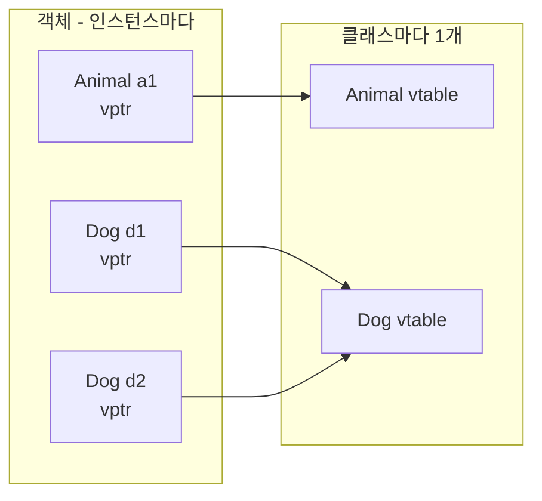
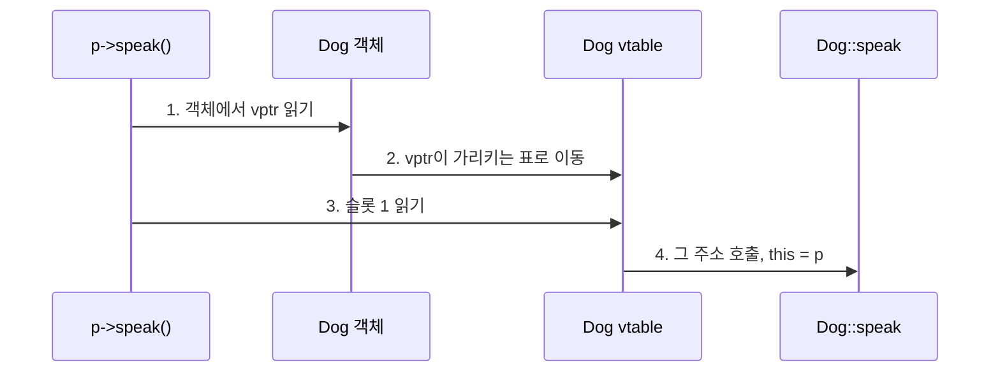

# vtable C++ Java 비교 정리

Qt `connect`에서 멤버 함수 주소를 넘기는 이유부터, C++ / Java의 가상 함수 테이블(vtable)까지 정리한 문서입니다.

관련 예제 코드는 `section02/P03_GUI_app`의 `connect` 호출입니다.

```cpp
connect(ui->pushButton, &QPushButton::clicked, this, &Widget::pushButtonClick);
```

---

## 1. Qt connect와 멤버 함수 주소

### 네 번째 인자를 `this->pushButtonClick`으로 쓰면 안 되는 이유

`connect`의 함수 포인터 오버로드는 대략 다음 의미를 가집니다.

| 인자 | 의미 |
| --- | --- |
| 1 | 시그널을 보내는 객체 (`ui->pushButton`) |
| 2 | 시그널 (클래스의 멤버 함수 주소, `&QPushButton::clicked`) |
| 3 | 슬롯을 실행할 **객체** (`this`) |
| 4 | 슬롯 (**클래스의** 멤버 함수 주소, `&Widget::pushButtonClick`) |

`this->pushButtonClick`은 멤버 함수 포인터가 아닙니다. 괄호를 붙이면 호출이 되고, 안 붙이면 C++에서 비정적 멤버 함수 주소로 쓸 수 없습니다.

비정적 멤버 함수 주소는 반드시 아래 형식입니다.

```cpp
&Widget::pushButtonClick
```

`this->`로 호출하고 싶다면 람다로 감싸야 합니다. 이때 `this->pushButtonClick()`은 포인터가 아니라 **호출**입니다.

```cpp
connect(ui->pushButton, &QPushButton::clicked, this, [this]() {
    this->pushButtonClick();
});
```

### 객체의 주소가 아니라 클래스의 주소

`&Widget::pushButtonClick`은 특정 객체(`this`)의 함수 주소가 아니라 **클래스의 멤버 함수 주소**입니다.

- `this`: 슬롯을 실행할 객체
- `&Widget::pushButtonClick`: 그 객체에서 호출할 멤버 함수 (클래스 기준)

비정적 멤버 함수 코드는 인스턴스마다 복사되지 않고, `Widget` 클래스에 하나만 있습니다. 그래서 주소도 객체에서 얻지 않고 클래스에서 얻습니다.

---

## 2. 정적 멤버 함수와 비정적 멤버 함수

멤버 함수는 **정적(static)** 과 **비정적(non-static)** 두 종류입니다.

**비정적**이 일반적인 멤버 함수입니다. 객체에 속하고, 호출할 때 `this`가 필요합니다.

```cpp
void Widget::pushButtonClick()   // 비정적
{
    qDebug() << Q_FUNC_INFO << "Hello, World";
}

widget->pushButtonClick();       // 객체가 있어야 호출 가능
```

**정적**은 `static`을 붙인 함수입니다. 클래스에는 속하지만 특정 객체에는 속하지 않아서 `this`가 없습니다.

```cpp
class Widget : public QWidget {
    static void hello();         // 정적
};

Widget::hello();                 // 객체 없이 클래스 이름으로 호출
```

| | 비정적 멤버 함수 | 정적 멤버 함수 |
| --- | --- | --- |
| `this` | 있음 | 없음 |
| 호출 | `객체.함수()` | `클래스::함수()` |
| 주소 문법 | `&Widget::pushButtonClick` | `&Widget::hello` |
| 포인터 타입 | 멤버 함수 포인터 `void (Widget::*)()` | 일반 함수 포인터 `void (*)()` |
| `connect` | 3번째에 객체 필요 | 객체 없이 함수만 넘겨도 됨 |

적어 두는 모양은 둘 다 `&클래스이름::함수이름`으로 같습니다. 다만 **같은 종류의 주소는 아닙니다.**

```cpp
&Widget::pushButtonClick   // 비정적 → 멤버 함수 포인터  void (Widget::*)()
&Widget::hello             // 정적   → 일반 함수 포인터  void (*)()
```

`connect(..., this, &Widget::pushButtonClick)`에서 `this`가 필요한 이유입니다. 비정적 슬롯은 **어느 Widget 인스턴스에서 실행할지**를 따로 넘겨야 합니다.

---

## 3. 함수 코드는 클래스에 하나, 데이터는 인스턴스마다

“비정적 함수도 인스턴스마다 있어야 하는 것 아닌가?”라는 직관은 흔히 빗나갑니다.

인스턴스마다 생기는 것은 **데이터(멤버 변수)** 입니다. 함수 코드는 복사되지 않습니다.

위젯을 두 개 만들면 메모리는 대략 다음과 같습니다.

```
코드 영역 (프로그램에 1개)
  Widget::pushButtonClick()   ← 함수 본체는 여기 하나뿐
  Widget::Widget()
  ...

w1 객체
  ui  (이 객체의 멤버 변수)

w2 객체
  ui  (다른 객체의 멤버 변수)
```

`pushButtonClick()` 기계어가 `w1`, `w2`마다 복제되면, 창을 1000개 만들 때 같은 함수가 1000번 복사됩니다. 그래서 C++는 함수는 클래스에 하나만 두고, 호출할 때 **어느 객체인지**만 `this`로 넘깁니다.

```cpp
w1.pushButtonClick();   // 내부적으로 this = &w1 을 넘겨서 같은 함수 실행
w2.pushButtonClick();   // this = &w2 를 넘겨서 같은 함수 실행
```

같은 함수 코드를 쓰지만, `this`가 다르니까 `ui` 같은 멤버 변수는 객체마다 다르게 보입니다.

정적 / 비정적의 차이는 **함수가 몇 개냐**가 아닙니다. 둘 다 클래스에 함수는 하나입니다.

| | 비정적 멤버 함수 | 정적 멤버 함수 |
| --- | --- | --- |
| 함수 코드 | 클래스에 1개 | 클래스에 1개 |
| `this` | 있음 → 멤버 변수 접근 가능 | 없음 → 인스턴스 멤버 변수 접근 불가 |
| 호출 | 객체가 필요 | 객체 없이 호출 가능 |

객체마다 필요한 것은 `ui` 같은 **상태**이고, `pushButtonClick` 같은 **동작(코드)** 은 클래스에 하나만 있으면 됩니다.

---

## 4. C++ / Java / C# 메모리 구조 비교

이 구조는 C++만의 방식이 아닙니다. Java, C#도 **함수 코드는 타입(클래스)에 하나, 데이터는 인스턴스마다** 둡니다.

세 언어 모두 대략 이렇게 나뉩니다.

```
클래스/타입 쪽 (하나)
  메서드 코드
  가상 함수 테이블 (vtable / method table)
  static 필드

인스턴스 쪽 (객체마다)
  인스턴스 필드
  (필요하면) 클래스/메서드 테이블을 가리키는 포인터
```

### C++

- 객체는 스택에도, `new`로 힙에도 둘 수 있습니다.
- 일반(비가상) 멤버 함수는 객체 안에 포인터조차 안 넣습니다. 호출이 컴파일 시점에 결정됩니다.
- 가상 함수가 있는 클래스만 객체 앞에 `vptr`(vtable 포인터)이 붙습니다.
- 가비지 컬렉터가 없고, 레이아웃을 비교적 직접 통제합니다.

### Java

- 객체는 전부 힙에 있습니다.
- 모든 객체 헤더에 클래스 정보 포인터가 있습니다. 메서드 코드는 객체 안이 아니라 **Metaspace(클래스 영역)** 에 있습니다.
- 인스턴스 필드는 객체마다, `static` 필드/메서드는 클래스에 하나입니다.
- 가상 호출은 클래스의 메서드 테이블을 타고 갑니다.

### C#

- Java와 거의 같습니다. 참조 타입 객체는 힙에 있고, 헤더에 MethodTable 포인터가 있습니다.
- 메서드 코드는 타입에 하나, 필드는 인스턴스마다입니다.
- `struct`는 스택/인라인에 값이 들어가지만, 메서드 코드는 그래도 타입에 하나뿐입니다.

| | 메서드 코드 | 인스턴스 필드 | 객체가 추가로 갖는 것 |
| --- | --- | --- | --- |
| C++ | 클래스에 1개 | 객체마다 | 가상 함수가 있을 때만 vptr |
| Java | 클래스(Metaspace)에 1개 | 객체마다 | 항상 클래스 포인터(헤더) |
| C# | 타입(MethodTable)에 1개 | 객체마다 | 항상 MethodTable 포인터(헤더) |

---

## 5. 가상 함수와 vtable

**vtable**은 “이 객체에서 이 함수를 호출하면, 실제로는 어느 구현을 실행할지”를 런타임에 고르기 위한 표입니다. C++와 Java 모두 이 아이디어를 쓰지만, **어떤 함수가 표에 들어가는지**가 다릅니다.

부모 타입 포인터/참조로 자식 객체를 가리킬 때, 컴파일러는 선언 타입만 압니다. 실제 타입은 실행 중에 알 수 있으므로 표로 찾아갑니다.

```
객체 ──(타입 포인터)──► 그 클래스의 함수 테이블
                              [0] foo 구현 주소
                              [1] bar 구현 주소
```

호출은 대략 `객체.테이블[슬롯번호]()` 입니다.

### C++

`virtual`을 붙인 멤버 함수만 런타임 디스패치입니다. 안 붙이면 컴파일 시점에 선언 타입 기준으로 호출이 고정됩니다.

- 가상 함수가 없는 클래스는 **vptr/vtable이 없습니다.**
- 가상 함수가 있으면 객체 앞에 **vptr**이 붙고, 그 클래스의 vtable을 가리킵니다.
- 자식 객체를 만들면 vptr은 **자식 클래스 vtable**을 가리킵니다.
- 다중 상속이 있어서 vtable이 여러 개이거나, 포인터 조정이 생길 수 있습니다.
- 소멸자도 다형적으로 지우려면 `virtual ~Animal()`이 필요합니다.

### Java

인스턴스 메서드는 기본적으로 전부 가상입니다. `virtual` 키워드가 없고, 막으려면 `final`을 붙입니다.

- 모든 객체 헤더에 **클래스 포인터**가 있습니다.
- 클래스 상속은 **단일 상속**입니다. 여러 타입을 섞을 때는 `interface`를 씁니다.
- 인터페이스 호출은 클래스 vtable과 조금 다른 경로(`itable` / `invokeinterface`)를 씁니다.
- `static` / `private` / `final`은 오버라이드 대상이 아니라서, 일반 가상 호출과 다릅니다.

### 호출이 결정되는 시점

| | C++ | Java |
| --- | --- | --- |
| 기본 멤버 함수 | 컴파일 시점 (비가상) | 런타임 (가상) |
| 가상으로 만드는 법 | `virtual`을 붙임 | 아무것도 안 붙임 (기본) |
| 가상을 막는 법 | `virtual`을 안 붙임, 또는 `final` | `final` |
| 객체에 붙는 것 | 가상 함수가 있을 때만 vptr | 항상 클래스 포인터 |
| 상속 | 다중 상속 가능 | 클래스는 단일, 인터페이스는 여러 개 |

Qt의 `QWidget`이 좋은 예입니다. `show()`, 이벤트 처리처럼 자식이 바꿔야 하는 함수는 C++에서 `virtual`입니다. 그래서 `QWidget*`로 가리켜도 실제 창 클래스의 구현이 호출됩니다.

한 줄로 말하면, **둘 다 “클래스마다 함수 주소 표 + 객체는 그 표를 가리킴”** 이고, C++는 필요한 함수만 표에 넣고 Java는 인스턴스 메서드를 기본적으로 표에 넣습니다.

---

## 6. Animal / Dog 예제로 보는 vtable

핵심은 **함수 코드는 클래스에 하나**이고, 객체는 **자기 타입의 표(vtable)** 만 가리킨다는 점입니다. `Animal*`로 `Dog`를 가리켜도, 표만 따라가면 `Dog::speak`를 찾습니다.

```cpp
class Animal {
public:
    virtual void speak();
    virtual void move();
    void id();              // 비가상 → vtable에 없음
    virtual ~Animal();
};

class Dog : public Animal {
public:
    void speak() override;  // 슬롯을 덮어씀
    void bark();            // 비가상 → vtable에 없음
};
```

### 객체와 표의 관계

vtable은 **클래스마다 1개**입니다. 객체마다 표를 복사하지 않고, 객체는 표 주소(`vptr`)만 가집니다.



`d1`과 `d2`는 데이터가 달라도 **같은 Dog vtable**을 봅니다.

### Animal / Dog vtable 내용

부모에서 정한 **슬롯 번호는 자식도 그대로** 씁니다. 덮어쓸 함수만 주소를 바꿉니다.

**Animal vtable**

| 슬롯 | 함수 | 실제 주소 |
| --- | --- | --- |
| 0 | 소멸자 | `Animal::~Animal` |
| 1 | `speak` | `Animal::speak` |
| 2 | `move` | `Animal::move` |

**Dog vtable**

| 슬롯 | 함수 | 실제 주소 | 의미 |
| --- | --- | --- | --- |
| 0 | 소멸자 | `Dog::~Dog` | 덮어씀 |
| 1 | `speak` | `Dog::speak` | 덮어씀 |
| 2 | `move` | `Animal::move` | 상속 그대로 |

`id()`와 `bark()`는 `virtual`이 아니라 **어느 표에도 없습니다.**

```
Dog 객체 d1
┌─────────────┐
│ vptr        │──┐
├─────────────┤  │
│ Animal 필드 │  │
├─────────────┤  │
│ Dog 필드    │  │
└─────────────┘  │
                 ▼
            Dog vtable          코드 영역
            ┌──────────────┐    ┌─────────────────┐
         0  │ Dog::~Dog    │───►│ Dog 소멸자 코드 │
         1  │ Dog::speak   │───►│ Dog::speak 코드 │
         2  │ Animal::move │───►│ Animal::move    │
            └──────────────┘    └─────────────────┘
```

### 런타임에 함수를 찾는 과정

```cpp
Animal* p = new Dog();
p->speak();
```

컴파일러는 `p`의 선언 타입이 `Animal*`라서, “`speak`는 슬롯 1”만 압니다. 실제 객체는 `Dog`입니다.



1. `p`가 가리키는 객체 맨 앞의 `vptr`을 읽습니다.
2. 그 `vptr`은 **Dog vtable**입니다. (`Animal` 객체를 가리켰다면 Animal vtable)
3. `speak`는 Animal이 정한 **슬롯 1**이므로 `vtable[1]`을 읽습니다.
4. 거기 들어 있는 `Dog::speak`를 호출하고, `this`로 `p`를 넘깁니다.

그래서 선언은 `Animal*`인데 실행은 `Dog::speak`가 됩니다. 이것이 동적 바인딩입니다.

`p->move()`면 슬롯 2이고, Dog가 덮어쓰지 않았으니 `Animal::move`가 실행됩니다.

### 왜 슬롯 번호가 같아야 하는가

호출 코드는 자식 타입을 모릅니다. `Animal*`만 보고 슬롯을 고릅니다.

```cpp
p->speak();   // 기계어 수준: call *(p->vptr + 1)
```

그래서 자식 vtable의 앞부분은 **부모와 같은 순서**여야 합니다.

```
슬롯    Animal              Dog
 0      ~Animal             ~Dog          ← 같은 역할, 다른 주소
 1      Animal::speak       Dog::speak    ← 같은 역할, 다른 주소
 2      Animal::move        Animal::move  ← 같은 역할, 같은 주소
```

순서가 어긋나면 `Animal*`로 `speak`를 호출했는데 엉뚱한 함수가 실행됩니다. 컴파일러가 이 레이아웃을 맞춰 줍니다.

### 생성 중에 vptr이 바뀌는 것

`new Dog()` 때 vptr은 처음부터 Dog가 아닙니다.

```
1. Animal 생성자 실행 중  → vptr = Animal vtable
2. Dog 생성자 실행        → vptr = Dog vtable
3. 소멸은 반대
   Dog 소멸자             → Dog vtable
   Animal 소멸자          → Animal vtable
```

그래서 **생성자/소멸자 안에서 가상 함수를 호출하면** 아직(또는 이미) 자식 테이블이 아니라서, 자식 오버라이드가 호출되지 않습니다.

---

## 7. 비가상 `bark()`는 vtable에 들어가지 않는다

C++에서 이 선언은 **비가상**입니다.

```cpp
class Dog : public Animal {
public:
    void speak() override;
    void bark();            // virtual 없음 → vtable에 안 들어감
};
```

`bark()`는 표에 없습니다. `dog.bark()`는 컴파일 시점에 `Dog::bark`로 고정됩니다.

vtable에 들어가려면 자식에서 새로 만들 때도 `virtual`이 필요합니다.

```cpp
virtual void bark();
```

그때만 Dog vtable 뒤에 슬롯 3이 생깁니다. 그래도 `Animal*`로는 `bark()`를 호출할 수 없습니다. 부모 표에 그 슬롯이 없기 때문입니다.

```cpp
Animal* p = new Dog();
p->speak();   // OK, 슬롯 1
p->bark();    // 컴파일 오류, Animal에 bark가 없음
```

`bark()`를 `Animal*`로 가상 호출하려면 애초에 `Animal`에 `virtual void bark()`를 선언해야 합니다.

---

## 8. Java의 method table

아이디어는 같습니다. 다만 Java는 인스턴스 메서드가 기본이 가상이라, 표에 들어가는 함수가 더 많습니다.

```
Dog 객체
┌──────────────────┐
│ 클래스 포인터     │──► Dog 클래스 메타데이터
│ 인스턴스 필드     │       speak → Dog.speak
└──────────────────┘       move  → Animal.move
                           bark  → Dog.bark   (Java에서는 기본이 가상)
```

| | C++ `p->speak()` | Java `a.speak()` |
| --- | --- | --- |
| 객체에서 읽는 것 | `vptr` | 클래스 포인터 |
| 표 | 그 클래스 vtable | 그 클래스 method table |
| 찾는 방식 | 슬롯 번호 | 슬롯 / 메서드 인덱스 |
| `id()` / `bark()`처럼 비가상 | 표에 없음, 컴파일 때 고정 | `final`/`private`/`static`이 아니면 표에 있음 |

Java도 `Animal a = new Dog(); a.speak();`이면 객체의 클래스 포인터가 `Dog`를 가리키므로 `Dog.speak`로 갑니다.

---

## 한 줄 정리

- **vtable**: 클래스마다 있는 “가상 함수 주소 목록”
- **vptr**: 객체마다 있는 “내 클래스는 이 표”라는 포인터
- **오버라이드**: 같은 슬롯의 주소만 자식 구현으로 교체
- **런타임 찾기**: 객체 → 표 → 슬롯 번호 → 함수 코드
- **비가상 함수**: 표에 들어가지 않고, 선언 타입 기준으로 컴파일 때 결정

`Animal* p = new Dog(); p->speak();`는 “`speak`는 슬롯 1이다”만 컴파일 때 정하고, **어느 표의 슬롯 1인지**는 실행 때 `p`의 실제 객체(Dog)를 보고 결정합니다.
